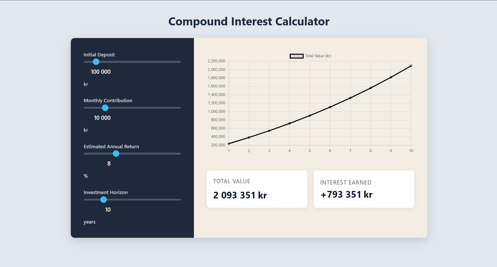

# Compound Interest Calculator 📈

A modern, interactive web application that visualizes the power of compound interest over time. Built to calculate long-term returns and visualize growth trajectories for investments in index funds and dividend stocks.

**🔗 [Click here to view the Live Demo](https://amsihk.github.io/compound-interest-calculator/)**

## Features

- Live calculation of compound interest
- Adjustable sliders for:
  - Initial deposit
  - Monthly contribution
  - Estimated annual return
  - Investment horizon
- Editable input fields with automatic formatting
- Real-time chart visualization using Chart.js
- Instant updates without page reload
  
##  Tech Stack

- HTML
- CSS
- JavaScript
- Chart.js

## Preview

## Getting Started

To run this project locally, simply clone the repository and open the `index.html` file in your browser
